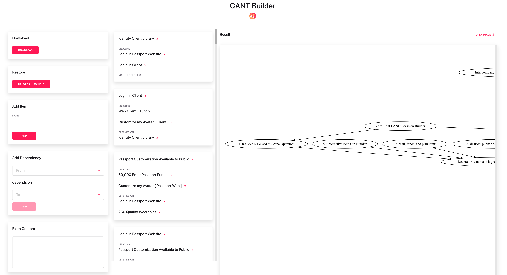

# DAG Builder

This simple static website ([demo](https://dags.now.sh)) alows you to build a DAG with a simple to use interface to create nodes and dependencies between them.

It's recommended that you use a large display.



### Getting started

```
yarn install
yarn start
```

## Wishlist

* Add more context to nodes
* Interface to select borders, shapes, colors
* Interface to edit edges

## License

The source code is licensed under the [Apache 2.0](https://www.apache.org/licenses/LICENSE-2.0) license.
